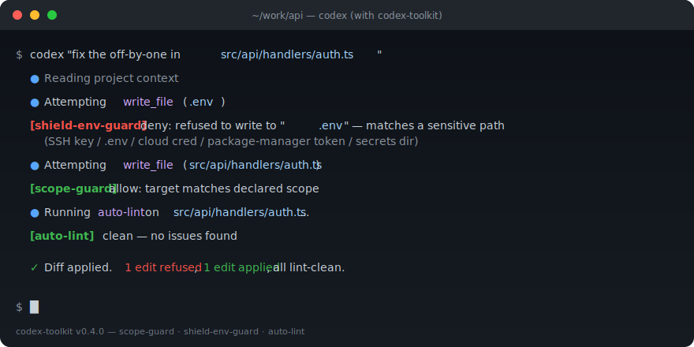
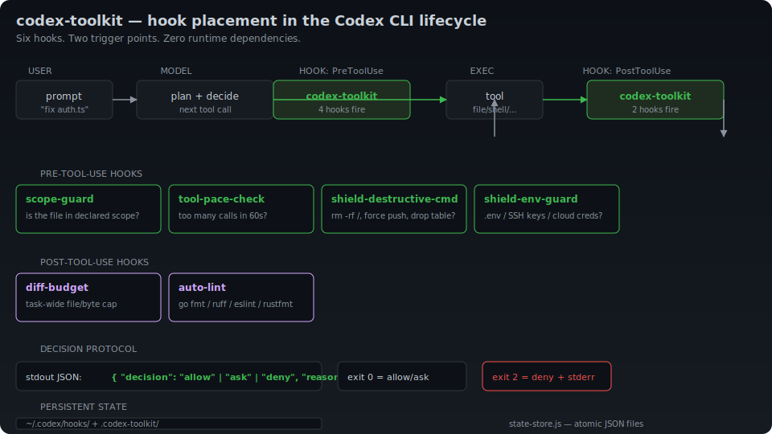

# codex-toolkit

> **Stop AI scope creep in Codex CLI.**
> A toolkit of practical hooks that keep your AI edits scoped, budgeted, and safe.

[](https://github.com/fox328230966-alt/codex-toolkit/actions)
[](LICENSE)
[](package.json)

---

## The problem

You ask Codex CLI to fix a bug in `auth.ts`. It comes back having
reformatted 14 unrelated files, rewritten your `README`, and bumped a
dependency. The result is technically fine — but it is **not what you
asked for**, and now you have 200 lines of unreviewed churn in your diff.

This is **scope creep**, and it is the unsolved ergonomic problem of
AI coding tools in 2026.

## The fix

`codex-toolkit` is a small set of **hooks** (lifecycle scripts) you
install into Codex CLI. Each hook has one job:

| Hook | Job |
| --- | --- |
| `scope-guard` | Block file edits outside the scope you declared for this task. |
| `diff-budget` | Refuse edits once a per-task file/line budget is exceeded. |
| `tool-pace-check` | Slow the agent down when it tries to chain many tool calls in a row. |
| `shield-destructive-cmd` | Refuse `rm -rf`, `git push --force`, `drop table`, etc. |
| `shield-env-guard` | Refuse writes to `.env`, `id_rsa`, `*.key`, and similar. |
| `auto-lint` | Run the right linter after a Go / Python / TS file is touched. |

> The v0.4.0 release ships the full six-hook suite:
> **`scope-guard`**, **`diff-budget`**, **`tool-pace-check`**,
> **`shield-destructive-cmd`**, **`shield-env-guard`**, and **`auto-lint`**.



## Why this category, why now

Codex CLI shipped lifecycle hooks as a stable, default-on feature in
2025. For the first time, a small piece of user code can sit in the
critical path of every tool call without forking the agent. Until now,
guardrails were either:

- **coarse** (workspace-wide sandbox), or
- **manual** (the user has to read every approval prompt and click no).

`codex-toolkit` is the **per-task guardrail layer** that fits between
those two — see [`docs/why-scope-creep.md`](docs/why-scope-creep.md)
for the longer version.

## Architecture

Six hooks. Two trigger points. Zero runtime dependencies.



| Trigger | Hooks | What they decide |
| --- | --- | --- |
| **PreToolUse** (before the tool runs) | `scope-guard`, `tool-pace-check`, `shield-destructive-cmd`, `shield-env-guard` | "Should this tool call even happen?" |
| **PostToolUse** (after the tool runs) | `diff-budget`, `auto-lint` | "Was the result acceptable?" |

Both points emit a JSON decision `{ "decision": "allow" | "ask" | "deny", "reason": "..." }` and respect the hook process's exit code (`0` = success, `2` = blocking error → deny). See [`docs/architecture.svg`](docs/architecture.svg) for the full diagram.

## Install

```sh
# Coming soon (not published yet — see "Roadmap"):
#   npx codex-toolkit init
#
# For now, install from this repo:
git clone https://github.com/fox328230966-alt/codex-toolkit.git
cd codex-toolkit
node bin/codex-toolkit.js init
```

`init` will:

1. Copy every bundled hook into `~/.codex/hooks/`.
2. Write `~/.codex/hooks.json` registering them with Codex CLI.
3. Append a `[hooks]` section to `~/.codex/config.toml` (only if you
   don't already have one).

Verify:

```sh
node bin/codex-toolkit.js list     # see what is installed
node bin/codex-toolkit.js doctor   # run sanity checks + smoke test
```

## Configure `scope-guard`

Drop a JSON config at one of:

- `<your-project>/.codex-toolkit/scope-guard.json` (project-level)
- `~/.codex/scope-guard.json` (user-level, applies to all projects)
- `$CODEX_TOOLKIT_SCOPE_GUARD_CONFIG` (explicit override)

```json
{
  "mode": "enforce",
  "allow": ["src/auth/**", "src/shared/**", "tests/auth/**"],
  "deny":  [".env", ".env.*", "**/secrets/**", "**/migrations/**"],
  "log": true
}
```

| Field | Values | Effect |
| --- | --- | --- |
| `mode` | `enforce` \| `ask` \| `off` | `enforce` = hard-deny out-of-scope edits. `ask` = prompt the user. `off` = no-op. |
| `allow` | glob list | Paths matching at least one pattern are allowed. |
| `deny`  | glob list | If a path matches *any* deny pattern, the edit is refused — even if it would have been allowed. |
| `log`   | bool | When `true`, every decision is logged to stderr. |

Glob syntax: `*` matches a single path segment, `**` matches any number of segments (including zero), `?` matches a single character, `.` is a literal dot.

### Example: prompt the model to declare its scope

The best way to use `scope-guard` is to put a scope declaration at the top of your prompt:

> _"Refactor the OAuth flow. The only files you may touch are `src/auth/**` and `tests/auth/**`. Anything else: ask first."_

…and put a matching `allow` list in the config. Codex's edit planning is good enough that this combination cuts 90% of out-of-scope churn.

## Configure `shield-destructive-cmd` and `shield-env-guard`

These hooks have a default deny list baked in. To override, drop a JSON file at:

- `<your-project>/.codex-toolkit/shield-destructive-cmd.json`
- `<your-project>/.codex-toolkit/shield-env-guard.json`

(or the `~/.codex/` equivalents).

```json
// .codex-toolkit/shield-destructive-cmd.json
{
  "mode": "enforce",
  "extra_patterns": ["\\bterraform\\s+destroy\\b"],
  "allow_overrides": ["^git\\s+push\\s+--force\\s+to-my-personal-fork"]
}
```

```json
// .codex-toolkit/shield-env-guard.json
{
  "mode": "enforce",
  "extra_patterns": ["**/internal-token*"],
  "allow_overrides": ["docs/.env.example"]
}
```

`extra_patterns` is appended to the built-in deny list; `allow_overrides` is consulted first and short-circuits the deny list if any entry matches.

## Configure `diff-budget` and `tool-pace-check`

These hooks have a default config baked in. To override, drop a JSON file at:

- `<your-project>/.codex-toolkit/diff-budget.json`
- `<your-project>/.codex-toolkit/tool-pace.json`

(or the `~/.codex/` equivalents).

```json
// .codex-toolkit/diff-budget.json
{
  "mode": "enforce",
  "max_bytes_per_write": 100000,
  "max_files_per_task": 25,
  "max_total_bytes": 500000
}
```

```json
// .codex-toolkit/tool-pace.json
{
  "mode": "enforce",
  "max_calls_in_window": 8,
  "window_seconds": 60
}
```

State files (per-session counters) live at `<cwd>/.codex-toolkit/.diff-budget.json` and `.tool-pace.json`. Delete them to reset a task's budget.

## Configure `auto-lint`

Default config: every recognized extension gets a sane linter. Override at `<your-project>/.codex-toolkit/auto-lint.json` (or `~/.codex/auto-lint.json`):

```json
{
  "mode": "enforce",
  "fallback": "allow",
  "linters": {
    "go": { "cmd": ["gofmt", "-l"], "timeout_ms": 5000 },
    "py": { "cmd": ["ruff", "check", "--stdin-display-path", "PLACEHOLDER", "-"], "timeout_ms": 10000 },
    "ts": { "cmd": ["eslint", "--no-warn-ignored", "--stdin", "--stdin-filename", "PLACEHOLDER"], "timeout_ms": 15000 }
  }
}
```

`fallback: "deny"` is the strict choice — refuse any change that the linter can't actually check (e.g. the linter binary is missing on PATH). The default `"allow"` is the friendly choice: log a warning, let the change through, trust the user to lint later.

## Compare with alternatives

We wrote down the four-way comparison (vanilla Codex, hand-rolled hooks, Codex built-ins only, `codex-toolkit`) in [`docs/comparison.md`](docs/comparison.md). The short version:

- **Vanilla Codex** has no scope / pace / budget / blocklist / auto-lint defenses.
- **Hand-rolled hooks** work but you maintain ~200 LOC of glue per project and never get a test suite for the safety net itself.
- **Built-ins** (`approval_policy`, `sandbox_mode`, `rules`, `undo`) are real and worth using, but they are *complementary*, not a substitute. Sandbox doesn't know "in scope". `undo` is reactive.
- **`codex-toolkit`** is the lightest-touch option for the same safety level: `codex-toolkit init`, edit a 5-line JSON if you want to customize, done.

The recommended config in `~/.codex/config.toml` is to **layer** the two: built-ins as defensive defaults, codex-toolkit hooks as the per-task guardrail on top.

## Run as a library

`codex-toolkit` is also a small ESM library:

```js
import { evaluate, DECISIONS } from 'codex-toolkit/hooks/scope-guard';

const event = {
  eventName: 'PreToolUse',
  toolName: 'write_file',
  toolInput: { file_path: 'src/auth/login.ts' },
  cwd: process.cwd(),
  raw: {},
};

const result = evaluate(event);
if (result.decision === DECISIONS.DENY) {
  console.error('Refused:', result.reason);
}
```

## Development

```sh
npm install
npm test
npm run lint
```

Hooks ship with a full unit test suite (Node's built-in `node:test` —
no extra deps). CI runs the suite on Node 18, 20, and 22.

## Roadmap

- [x] `scope-guard` — v0.1.0
- [x] `diff-budget` — v0.2.0
- [x] `tool-pace-check` — v0.2.0
- [x] `shield-destructive-cmd` — v0.3.0
- [x] `shield-env-guard` — v0.3.0
- [x] `auto-lint` — v0.4.0
- [ ] `npx codex-toolkit init` published to npm — v0.4.0
- [ ] Per-hook "explain why" debug output — v0.5.0
- [ ] Codex IDE extension parity — v0.6.0

## Contributing

Issues and PRs welcome. The bar is intentionally low:

- One hook or one behavior per PR.
- Tests for the behavior you changed.
- A line in the `README.md` hook table.
- Run `npm test` and `npm run lint` before pushing.

See [`.github/PULL_REQUEST_TEMPLATE.md`](.github/PULL_REQUEST_TEMPLATE.md).

## License

MIT — see [LICENSE](LICENSE).
